<p align="center">
  
</p>

AI skills that turn natural language into production-quality UiPath Studio projects - powered by **94 deterministic Python generators**, **71 lint rules**, and **real Studio-exported templates**. No hallucinated XAML. No guessed selectors. Every `.xaml` file opens cleanly in UiPath Studio.

## The problem

LLMs are bad at generating UiPath code. The XAML they produce is typically invalid - wrong namespaces, hallucinated activity names, broken selectors, missing ViewState blocks, incompatible NuGet versions. Most of it won't even open in Studio.

**uipath-ai-skills** fixes this by constraining and shaping LLM output through deterministic generators, real Studio-exported templates, and a validation layer that catches hallucination patterns before they reach your project.

---

## Some examples of what you can build

| Automation type | Description | Recommended project |
|---|---|---|
| **Web form filling** | Browser-based data entry with real selectors from Playwright inspection | Sequence or REFramework |
| **Queue dispatching** | Read data sources (Excel, DB, API) and populate Orchestrator queues | REFramework Dispatcher |
| **Queue processing** | Process queue items with retry logic, exception handling, and status tracking | REFramework Performer |
| **API integrations** | HTTP requests with OAuth, retry policies, JSON parsing, credential management | Sequence |
| **Excel processing** | Read, filter, transform, and write Excel data with LINQ expressions | Sequence |
| **PDF extraction** | Extract text from PDFs using native parsing or OCR | Sequence |
| **Email automation** | IMAP retrieval, attachment processing, and sending via Integration Service | Sequence |
| **Desktop automation** | Win32/WPF/WinForms app automation with PowerShell-inspected selectors | Sequence or REFramework |
| **Multi-app orchestration** | Processes spanning multiple web and desktop applications | REFramework Performer |

---

## How it works

```mermaid
flowchart LR
    A["Describe automation\nin plain English"] --> B["Agent reads\nSKILL.md routing table"]
    B --> C{"Project\nexists?"}
    C -->|No| D["scaffold_project.py\n(sequence / dispatcher / performer)"]
    C -->|Yes| U{"UI\nautomation?"}
    D --> U
    U -->|Yes| E["Inspect target app(s) UI"]
    E --> F["Write JSON specs\nto disk"]
    U -->|No| F
    F --> G["generate_workflow.py\n(94 deterministic generators)"]
    G --> H["validate_xaml\n(71 lint rules)"]
    H -->|Errors| G
    H -->|Pass| I["generate_object_repository.py\n(selectors -> .objects/)"]
    I --> K["modify_framework.py\n+ resolve_nuget.py"]
    K --> J["Complete UiPath\nproject"]
```



The skill uses four layers to ensure valid output:

1. **Deterministic generators** - 94 Python functions that produce structurally correct XAML for each activity type. The LLM writes a JSON spec (which LLMs handle well); generators handle the complex XML structure (which LLMs handle poorly). Every enum value, child element, namespace, and attribute is locked down.

2. **Studio-exported templates** - every generator is anchored to real XAML exported from UiPath Studio 24.10. Not documentation examples - actual working files.

3. **Lint validation** - 71 rules that specifically target the hallucination patterns LLMs produce when generating UiPath XAML. Catches issues before you open Studio.

4. **Framework wiring** - `modify_framework.py` wires `InvokeWorkflowFile` calls into framework files, injects variables, replaces scaffold markers, and chains UiElement arguments. `generate_object_repository.py` builds the `.objects/` tree from captured selectors. Both ensure the generated project is structurally complete.

---

## Built-in best practices

The skill doesn't just generate valid XAML - it enforces the patterns that experienced UiPath developers apply manually:

- **Modular decomposition** - one workflow per action, organized in `Workflows/<AppName>/` subfolders. Main.xaml orchestrates via `InvokeWorkflowFile` and never contains business logic directly.
- **Config-driven everything** - URLs, credential asset names, queue names, and application settings live in Config.xlsx. Nothing is hardcoded in workflows.
- **Credential security** - passwords are always `SecureString`, never `String`. `GetRobotCredential` is called inside the Launch workflow at minimal scope - never in InitAllApplications, never passed as arguments between workflows.
- **REFramework architectural discipline** - InitAllApplications opens all apps and gets them to a ready state. Process.xaml and action workflows are attach-only (`OpenMode="Never"`). SetTransactionStatus is never modified. Login stays inside `AppName_Launch.xaml`.
- **Browser discipline** - incognito mode by default, one browser instance per web app, no logout actions (close the browser instead). Navigates by URL (`NGoToUrl` with Config-driven URLs) instead of fragile UI click-paths whenever the target page has a direct URL.
- **Selector standards** - strict selectors over fuzzy, single-quoted attributes, dynamic selectors via Config for environment-dependent values.
- **Naming conventions** - type-prefixed variables (`strName`, `dt_Report`), direction-prefixed arguments (`in_strUrl`, `out_boolSuccess`), PascalCase workflows with app prefixes (`ACME_Login.xaml`).

These are just the highlights - the skill encodes dozens of additional rules covering API retry patterns, extraction/filtering separation, queue dispatch patterns, error handling hierarchy, and more. See `references/rules.md` for the full set.

---

## Activity generators (94)

Every generator is deterministic: same input produces identical XAML output with correct enums, namespaces, child elements, and ViewState.

<details>
<summary><strong>View all 94 generators by category</strong></summary>

| Category | Count | Generators |
|---|---|---|
| **UI Automation** | 11 | `nclick`, `ntypeinto`, `nselectitem`, `ngettext`, `ncheckstate`, `ncheck`, `nhover`, `ndoubleclick`, `nrightclick`, `nkeyboardshortcuts`, `nmousescroll` |
| **Application Card** | 4 | `napplicationcard_open`, `napplicationcard_attach`, `napplicationcard_close`, `napplicationcard_desktop_open` |
| **Navigation** | 4 | `ngotourl`, `ngeturl`, `nextractdata`, `pick_login_validation` |
| **Control Flow** | 12 | `if`, `if_else_if`, `foreach`, `foreach_row`, `foreach_file`, `while`, `do_while`, `switch`, `flowchart`, `state_machine`, `parallel`, `parallel_foreach` |
| **Data Operations** | 15 | `assign`, `multiple_assign`, `build_data_table`, `add_data_row`, `add_data_column`, `filter_data_table`, `sort_data_table`, `join_data_tables`, `lookup_data_table`, `merge_data_table`, `output_data_table`, `remove_data_column`, `remove_duplicate_rows`, `generate_data_table`, `variables_block` |
| **Dialogs** | 2 | `input_dialog`, `message_box` |
| **Error Handling** | 4 | `try_catch`, `throw`, `rethrow`, `retryscope` |
| **File System** | 9 | `copy_file`, `move_file`, `delete_file`, `create_directory`, `path_exists`, `read_text_file`, `write_text_file`, `read_csv`, `write_csv` |
| **HTTP / JSON** | 2 | `net_http_request`, `deserialize_json` |
| **Integrations** | 12 | `read_range`, `write_range`, `append_range`, `write_cell`, `get_imap_mail`, `send_mail`, `save_mail_attachments`, `read_pdf_text`, `read_pdf_with_ocr`, `database_connect`, `execute_query`, `execute_non_query` |
| **Invoke** | 3 | `invoke_workflow`, `invoke_code`, `invoke_method` |
| **Logging & Misc** | 11 | `logmessage`, `comment`, `comment_out`, `break`, `continue`, `kill_process`, `add_log_fields`, `remove_log_fields`, `should_stop`, `take_screenshot_and_save`, `terminate_workflow` |
| **Orchestrator** | 5 | `add_queue_item`, `bulk_add_queue_items`, `get_queue_item`, `get_robot_asset`, `getrobotcredential` |

</details>

---

## Validation pipeline

71 lint rules organized by severity, specifically targeting patterns where LLMs commonly generate incorrect XAML.

| Severity | What it catches | Examples |
|---|---|---|
| **ERROR** | Studio crashes and compile failures | Hallucinated enum values, missing `xmlns` declarations, wrong child elements, non-existent properties |
| **WARN** | Runtime failures and silent data loss | Wrong enum namespace, empty Out argument bindings, type mismatches, C# syntax in VB.NET Throw expressions |
| **INFO** | Best practices and architecture | Missing log bookends, hardcoded URLs, credentials passed as arguments, missing RetryScope on API calls |

```bash
python3 scripts/validate_xaml <project_or_file> --lint        # check
python3 scripts/validate_xaml <project_or_file> --lint --fix   # auto-fix common issues
```

<details>
<summary><strong>What the lint rules catch</strong></summary>

**Hallucination prevention:**
- Non-existent properties (`NApplicationCard.Url`, `NCheckState.Appears`, `NTypeInto.EmptyField`)
- Invalid enum values that crash Studio (`Version="V3"`, `ElementType="InputBoxText"`)
- Placeholder file paths (`C:\path\to\app.exe`)
- Hallucinated activity names and namespace prefixes

**Activity-specific validation:**
- NTypeInto, NClick, NCheckState, NSelectItem, NGetText property correctness
- DataTable operation type consistency and FilterOperator enum validation
- REFramework structure rules (GetQueueItem/SetTransactionStatus patterns)
- Selector syntax validation and app/screen/element hierarchy checks

**Production safety:**
- Credentials must use `GetRobotCredential` (never passed as arguments)
- API/network calls wrapped in RetryScope
- URLs sourced from Config.xlsx (never hardcoded)
- Browser defaults enforced (IsIncognito, InteractionMode)

</details>

---

## Available skills

| Skill | Status | Description |
|-------|--------|-------------|
| **[uipath-core](./uipath-core/)** | Released | XAML generation, REFramework scaffolding, selector generation, lint validation |
| uipath-sap-wingui | Planned | SAP GUI for Windows automation |
| uipath-action-center | Planned | Human-in-the-loop form tasks and approval workflows |
| uipath-du | Planned | Taxonomy, extraction, classification, validation pipelines |

Plugin skills extend the core through `plugin_loader.py` (API version 1) - registering generators, lint rules, scaffold hooks, and namespaces that the core engine auto-discovers at runtime.

<details>
<summary><strong>Plugin registration API</strong></summary>

```python
from plugin_loader import register_generator, register_lint, register_scaffold_hook, register_namespace

# Add a custom XAML generator
register_generator("my_activity", gen_my_activity, display_name="MyActivity")

# Add custom lint rules
register_lint(my_lint_function, "lint_my_rules")

# Add a scaffold hook (runs after project creation)
register_scaffold_hook(my_post_scaffold_hook)

# Register XML namespace for the plugin's activities
register_namespace("mypfx", "clr-namespace:MyNamespace;assembly=MyAssembly")
```

</details>

---

## Installation

```bash
git clone https://github.com/marcelocruzrpa/uipath-ai-skills.git

# Optional: install openpyxl for Config.xlsx management
pip install "openpyxl>=3.1.0"
```

No other dependencies required - all core scripts use Python stdlib.

<details>
<summary><strong>Claude Code</strong></summary>

**Via plugin marketplace (recommended):**

```
/plugin marketplace add marcelocruzrpa/uipath-ai-skills
/plugin install uipath-core@uipath-ai-skills
```

**Manual (run from the repo directory):**

```bash
cd uipath-ai-skills
claude
```

Claude auto-detects `SKILL.md` files. Verify: ask *"List my available skills"* - you should see `uipath-core`.

To copy into another project:

```bash
mkdir -p <your-project>/.claude/skills
cp -r uipath-ai-skills/uipath-core <your-project>/.claude/skills/
```
</details>

<details>
<summary><strong>Codex CLI</strong></summary>

```bash
mkdir -p .codex/skills
cp -r uipath-ai-skills/uipath-core .codex/skills/uipath-core
codex
```

Or install globally: `cp -r uipath-ai-skills/uipath-core ~/.codex/skills/uipath-core`

If Codex truncates the skill, increase the instruction limit in `~/.codex/config.toml`:

```toml
project_doc_max_bytes = 131072  # 128 KB
```
</details>

### Setting up selector generation (optional)

Selector generation connects your agent to live applications. Without it, the skill still generates full projects - you'll just need to fill in selectors manually in Studio.

<details>
<summary><strong>Web selectors (Playwright MCP)</strong></summary>

1. Install: `npx @playwright/mcp@latest`
2. Add to your agent's MCP config ([Playwright MCP docs](https://github.com/microsoft/playwright-mcp))
3. The skill opens a browser automatically and navigates to the target URL
4. Inspection is **read-only** - the agent never types credentials or submits forms
</details>

<details>
<summary><strong>Desktop selectors (inspect-ui-tree.ps1)</strong></summary>

1. The agent opens the target desktop app (or asks permission to open it)
2. The agent runs the script directly via PowerShell to capture the UIA element tree
3. Works with WPF, Win32, WinForms, DirectUI, UWP. Inspection is **read-only**

No setup needed — `inspect-ui-tree.ps1` ships with the skill.
</details>

---

## Key design decisions

**XAML is never hand-written.** All XAML is produced by deterministic Python generators. This eliminates the #1 source of errors: LLM hallucination of XML structures, enum values, and namespace declarations.

**JSON specs as intermediate format.** LLMs are good at JSON. LLMs are bad at XML. The JSON spec format lets the agent describe *what* it wants while generators handle the complex XAML structure.

**Real templates, not invented ones.** Every template in `assets/` is a genuine UiPath Studio 24.10+ export. Nothing was constructed from documentation or memory.

**Lint rules target LLM hallucination patterns.** The 71 lint rules aren't generic XML validators - they specifically catch the mistakes LLMs make when generating UiPath XAML.

**Plugin architecture for extensibility.** Domain-specific capabilities (SAP, Action Center, etc) are added as plugins that register their own generators, lint rules, and scaffold hooks without modifying core code.

---

## Platform support

| Capability | Environment |
|-----------|-------------|
| Generate / scaffold projects | Python 3.10+ - cross-platform |
| Open generated projects | UiPath Studio 2024.10+ on Windows (older versions may work) |
| Web selector generation | Playwright MCP - cross-platform |
| Desktop selector generation | Windows + PowerShell |
| Config.xlsx management | Python + `openpyxl` - cross-platform |

### Prerequisites

| Dependency | Notes |
|-----------|-------|
| **Python 3.10+** | Core scripts use stdlib only |
| **`openpyxl`** *(optional)* | `pip install openpyxl` - for Config.xlsx operations |
| **Claude Opus or Claude Sonnet** *(recommended)* | Opus delivers best results for new projects. Sonnet is great for updates to existing projects. Smaller models hallucinate more on complex projects. Works with other LLMs such as OpenAI GPT |
| **Node.js 18+** *(optional)* | For running Playwright MCP server |
| **Playwright MCP** *(optional)* | For live web app inspection and selector generation |

---

## Limitations

- Tested against **UiPath Studio 2024.10+ Windows** with **Modern UI Automation** activities
- Output quality depends on PDD clarity and scope - the agent will ask clarifying questions when instructions are vague, but more detailed PDDs produce better workflows
- Live web selector generation requires Playwright MCP setup; desktop inspection requires PowerShell on Windows. Without these, selectors need manual completion in Studio
- Desktop inspection is **Windows-only** (UIA is a Windows API)
- Browser inspection is **read-only** and stops at login gates - it cannot type credentials or navigate past authentication
- Not every arbitrary PDD converts perfectly without iteration and refinement
- The tool does not invent real credentials, API keys, or perform login on the user's behalf

---

## Verification

```bash
# Lint validation
python3 scripts/validate_xaml <project_folder> --lint

# Lint test suite (81 test cases)
python3 scripts/run_lint_tests.py

# Regression suite (18 tests)
python3 scripts/regression_test.py

# Generator snapshot tests
python3 scripts/test_generator_snapshots.py

# Scaffold a test project
python3 scripts/scaffold_project.py --name "test-project" --variant performer --output /tmp/test

# Resolve latest NuGet package versions
python3 scripts/resolve_nuget.py --all

# Validate Config.xlsx keys against XAML references
python3 scripts/config_xlsx_manager.py validate <project_folder>
```

---

## Troubleshooting

**`ModuleNotFoundError: No module named 'openpyxl'`** - Run `pip install openpyxl`. Needed for Config.xlsx operations.

**NuGet resolution fails / times out** - Needs outbound HTTPS to `pkgs.dev.azure.com`. Falls back to cached versions if blocked.

**MCP server not found** - Check your agent's MCP config. For web apps, Playwright MCP is used for live selector inspection. Without it, the skill still generates projects - selectors will need manual completion in Studio.

**Inspection stops at login page** - Browser inspection is read-only and cannot type credentials. Log in manually first, then have the skill inspect the authenticated page.

**Generated project won't open in Studio** - Ensure your Studio version supports Modern activities. Run `python3 scripts/validate_xaml <project> --lint` to identify specific issues.

---

## Project structure

<details>
<summary><strong>View full directory tree</strong></summary>

```
uipath-ai-skills/
|-- README.md
|-- CONTRIBUTING.md
|-- CHANGELOG.md
|-- LICENSE
|
|-- uipath-core/
|   |-- SKILL.md
|   |-- requirements.txt
|   |-- evals/
|   |   \-- core-battle-tests.md
|   |-- references/                            # 24 reference docs
|   |   |-- rules.md                           # Ground rules (G/I/A/P/S rule IDs)
|   |   |-- skill-guide.md                     # Worked examples and anti-patterns
|   |   |-- generation.md                      # Object Repository, JSON spec format, generators
|   |   |-- scaffolding.md                     # Template selection, NuGet mapping, project setup
|   |   |-- decomposition.md                   # Naming, architecture rules, workflow patterns
|   |   |-- cheat-sheet.md                     # Quick-reference generator and activity lookup
|   |   |-- xaml-foundations.md                # XAML structure, namespaces, core activities
|   |   |-- xaml-ui-automation.md              # Selectors, anchors, fuzzy/regex targeting
|   |   |-- xaml-control-flow.md               # If, ForEach, While, Flowchart, StateMachine
|   |   |-- xaml-data.md                       # DataTable, filtering, sorting, joining
|   |   |-- xaml-error-handling.md             # TryCatch, RetryScope, exception types
|   |   |-- xaml-invoke.md                     # InvokeWorkflow, InvokeCode, InvokeMethod
|   |   |-- xaml-orchestrator.md               # Queues, credentials, HTTP, assets
|   |   |-- xaml-integrations.md               # Excel, Email, PDF, Database
|   |   |-- expr-foundations.md                # VB.NET/C# expression basics
|   |   |-- expr-strings-datetime.md           # String and DateTime expressions
|   |   |-- expr-datatable.md                  # DataTable LINQ and manipulation
|   |   |-- expr-collections-json.md           # Collections, JSON, type conversions
|   |   |-- config-sample.md                   # Config.xlsx three-sheet reference
|   |   |-- playwright-selectors.md            # Playwright -> UiPath selector mapping
|   |   |-- ui-inspection.md                   # Playwright and desktop inspection workflows
|   |   |-- ui-inspection-reference.md         # inspect-ui-tree.ps1 property mapping
|   |   |-- golden-templates.md                # Template catalog from Studio exports
|   |   \-- lint-reference.md                  # All 71 lint rules documented
|   |-- scripts/
|   |   |-- generate_workflow.py               # JSON spec -> validated XAML (main entry point)
|   |   |-- generate_activities/               # 94 deterministic generators
|   |   |   |-- ui_automation.py               #   NClick, NTypeInto, NGetText, ...
|   |   |   |-- application_card.py            #   NApplicationCard open/attach/close
|   |   |   |-- navigation.py                  #   NGoToUrl, NExtractData, Pick
|   |   |   |-- control_flow.py                #   If, ForEach, While, Switch, Flowchart
|   |   |   |-- data_operations.py             #   Assign, BuildDataTable, Filter, Sort
|   |   |   |-- error_handling.py              #   TryCatch, Throw, RetryScope
|   |   |   |-- orchestrator.py                #   AddQueueItem, GetRobotCredential
|   |   |   |-- file_system.py                 #   Copy/Move/Delete, CSV, text files
|   |   |   |-- http_json.py                   #   NetHttpRequest, DeserializeJson
|   |   |   |-- integrations.py                #   Excel, Email, PDF, Database
|   |   |   |-- invoke.py                      #   InvokeWorkflow, InvokeCode
|   |   |   |-- logging_misc.py                #   LogMessage, Comment, Break, KillProcess
|   |   |   \-- dialogs.py                     #   InputDialog, MessageBox
|   |   |-- validate_xaml/                     # 71 lint rules
|   |   |   |-- lints_hallucinations.py        #   AI-generated XAML error detection
|   |   |   |-- lints_activities.py            #   Activity-specific validation
|   |   |   |-- lints_data.py                  #   DataTable and type consistency
|   |   |   |-- lints_variables.py             #   Naming conventions and directions
|   |   |   |-- lints_ui.py                    #   Selector and UI hierarchy validation
|   |   |   |-- lints_selectors.py             #   Selector syntax and structure
|   |   |   |-- lints_types.py                 #   Type argument validation
|   |   |   |-- lints_framework.py             #   REFramework architecture rules
|   |   |   \-- lints_project.py               #   project.json and cross-file checks
|   |   |-- scaffold_project.py                # Project scaffolding (sequence/dispatcher/performer)
|   |   |-- modify_framework.py                # Framework wiring and variable injection
|   |   |-- resolve_nuget.py                   # Live NuGet version resolution
|   |   |-- generate_object_repository.py      # Object Repository from selectors.json
|   |   |-- config_xlsx_manager.py             # Config.xlsx add/list/validate
|   |   |-- plugin_loader.py                   # Plugin discovery and registration (API v1)
|   |   |-- dependency_graph.py                # Workflow dependency analysis
|   |   |-- grade_battle_test.py               # Semi-automated battle test grading
|   |   |-- inspect-ui-tree.ps1                # Desktop UIA tree inspector
|   |   |-- run_lint_tests.py                  # Lint test runner (79 cases)
|   |   |-- regression_test.py                 # Regression suite (16 tests)
|   |   \-- test_generator_snapshots.py        # Generator snapshot tests
|   \-- assets/
|       |-- reframework/                       # Clean REFramework template (Studio 24.10)
|       |-- simple-sequence-template/          # Sequence scaffold template
|       |-- simple-sequence/                   # Sequence golden samples
|       |-- samples/                           # Common workflow pattern samples
|       |-- stripped/                          # Minimal XAML templates for generators
|       |-- generator-snapshots/               # 15 regression fixtures for generators
|       \-- lint-test-cases/                  # 105 bad/good XAML test files
|
|-- uipath-sap-wingui/                         # (planned)
|-- uipath-action-center/                      # (planned)
\-- uipath-du/            # (planned)
```

</details>

---

## Contributing

See [CONTRIBUTING.md](./CONTRIBUTING.md) for guidelines. Contributions welcome - especially bug reports with Studio error messages, golden XAML samples from real exports, and new lint rules for hallucination patterns. See [CHANGELOG.md](./CHANGELOG.md) for release history.

---

## License

[MIT License](./LICENSE)

---

## Contributors

Thanks to all contributors:

<a href="https://github.com/marcelocruzrpa/uipath-ai-skills/graphs/contributors">
  
</a>

---

## Author

Built by [Marcelo Cruz](https://www.linkedin.com/in/marcelo-cruz-rpa/) - UiPath MVP.
